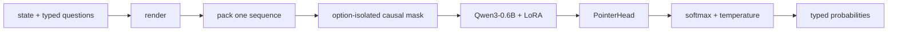

# Hev

Small, option-order-invariant decision model. Typed questions in, calibrated probabilities out, one prefill, no decoding.

<p>
  <a href="https://github.com/nafisazizir/hev/actions/workflows/ci.yml"></a>
  <a href="MODEL_CARD.md"></a>
  <a href="LICENSE"></a>
</p>

Hev is a LoRA adapter and PointerHead on `Qwen/Qwen3-0.6B-Base`. It reads one state, answers many typed questions in parallel and returns probability distributions without generating text.

Its experiment is narrow: kev isolates questions; Hev also isolates every option from its sibling options. Every option receives the same positions and can attend only to the state, its question and itself. Reordering Choice options therefore cannot change their backbone representations. The readout is permutation-equivariant, so semantic answers are invariant by construction.

Hev is an independent research project. It is not Jev, is not affiliated with TypeSafe and does not claim to reproduce Jev's private implementation.

## Highlights

- **Small on purpose.** A 0.6B backbone, LoRA rank 16 and a 256-dimensional pointer readout.
- **Exact option isolation.** An option never reads a sibling option. Choice order is nuisance, not signal.
- **One pass, many answers.** State and questions share one prefill; there is no decoding loop.
- **Probabilities, not prose.** Cross-entropy training plus calibration-only temperature scaling.
- **Three question types.** `noul`, `choice` and ordinal `score` use one scoring primitive.
- **Auditable research.** Frozen suites, locked tests, immutable runs and claim-linked result ledgers.

## Installation

Requires Python 3.12+ and [uv](https://docs.astral.sh/uv/). The research runs used Apple Silicon MPS. CUDA is implemented but not validated here.

```bash
git clone https://github.com/nafisazizir/hev.git
cd hev
uv sync --group dev --extra serve
```

Model weights are not committed to git. The release layout uses one Hugging Face repository with `seed-0` and `seed-1` revisions; neither is presented as the better seed. Until a Hub namespace is chosen, replace `OWNER` below.

```bash
uv run --extra serve python -m hev.serve --run hf://OWNER/hev-0.6b@seed-0 --port 8008
```

A local evaluated run works too:

```bash
uv run --extra serve python -m hev.serve --run runs/m3-pointer-s1 --port 8008
```

## Quick Start

```bash
curl -s localhost:8008/v1/systemone \
  -H 'content-type: application/json' \
  -d '{
    "state": "The parcel arrived late and the card was charged twice.",
    "model": "hev-latest",
    "questions": {
      "route": {
        "type": "choice",
        "instructions": "Which team should handle this?",
        "criteria": {
          "shipping": "Delivery and tracking",
          "billing": "Charges and payments",
          "returns": "Refunds and exchanges"
        }
      },
      "urgent": {
        "type": "noul",
        "instructions": "Does this need urgent attention?"
      },
      "frustration": {
        "type": "score",
        "instructions": "How frustrated is the customer?",
        "criteria": ["Calm", "Frustrated", "Very angry"]
      }
    }
  }'
```

The server also works with the official TypeSafe SDK by changing `base_url` to `http://127.0.0.1:8008` and using model `hev-latest`.

## API

### `POST /v1/systemone`

| Type | Input | Output |
|---|---|---|
| `noul` | instructions, optional true/false criteria | `p(yes)` |
| `choice` | instructions, keyed criteria | semantic key, full distribution, confidence |
| `score` | instructions, ordered levels | expected level, full distribution, confidence |

Structured state, instructions and criteria are rendered to labelled text. Reserved delimiters are rewritten out of user content. Validation errors return `422`.

### `GET /v1/models`

Returns the loaded run, base model, head and calibration temperature.

The server has no authentication and permissive CORS. It binds to `127.0.0.1` and is intended for local research only.

## How It Works



For query token `i` and key token `j`, attention is allowed only when `j <= i` and the key is in the shared state, the current question instruction, or the same option branch. Every option starts at the same position. `h(option)` is therefore a function of `(state, instruction, option text)`, not list position or siblings.

The selected PointerHead scores each option independently:

```text
logit_j = <Wq h_decide, Wk h_option_j> / sqrt(256)
```

See [DESIGN](docs/DESIGN.md) for the mask, positions and invariance argument. Open [the illustrated explainer](docs/explainer.html) in a browser for a worked request.

## Results

All numbers are on frozen **development** splits. The locked test split has not been accessed.

| Model | Decision accuracy | Transfer accuracy | Decision calibrated ECE |
|---|---:|---:|---:|
| **Hev PointerHead** | **80.00%** (79.33–80.67) | **60.71%** (60.36–61.07) | **0.020** |
| kev Qwen3-0.6B | 80.46% (79.33–81.58) | 62.05% (61.96–62.14) | 0.030 |
| Jev `1.13.0` | 83.50% | 85.36% | 0.103 |

Hev and kev are two-seed means with ranges. Jev is one hosted snapshot, not a seed average. This is the same evaluation, not a controlled training comparison: systems differ in architecture, training, compute and availability.

### Option order

| Model | Protocol | Decision flips | Transfer flips | Probability movement |
|---|---|---:|---:|---:|
| **Hev Pointer seed 0** | six orders, all eligible Choice | **0 / 696** | **0 / 348** | p90 correct-probability spread `1.25e-6` / `2.74e-6` |
| **Hev Pointer seed 1** | six orders, all eligible Choice | **0 / 696** | **0 / 348** | p90 spread `1.45e-6` / `2.86e-6` |
| kev seed 0 / 1 | clean plus one fixed permutation | 5.56% / 4.17% of 72 | 8.33% / 8.33% of 36 | mean max change `0.047` / `0.026`; transfer `0.090` / `0.083` |
| Jev `1.13.0` | clean plus one fixed permutation | 1.39% of 72 | 0% of 36 | maximum change `0.456` / `0.200` |

The protocols differ: Hev receives the stronger exhaustive study; kev and Jev use one frozen permutation. The result supports exact Hev invariance. It does not show that invariance improves accuracy, and zero observed Jev transfer flips do not establish Jev's architecture.

Full metrics, uncertainty, calibration caveats and task breakdowns are in [RESULTS](docs/RESULTS.md). The authoritative aggregate is [`runs/m3-three-way-v2-r1/result.json`](runs/m3-three-way-v2-r1/result.json).

## Reproduce

Offline tests:

```bash
PYTHONDONTWRITEBYTECODE=1 uv run pytest -p no:cacheprovider
```

Train the selected seed-0 recipe:

```bash
uv run python -m hev.train \
  --suite evals/decision-v2 \
  --out runs/pointer-s0 \
  --head pointer \
  --device mps \
  --seed 0 \
  --epochs 2 \
  --lr 2e-4 \
  --lora 16 \
  --batch 1 \
  --accum 8 \
  --ord-w 0 \
  --p-none 0.1 \
  --p-none-distract 0.12 \
  --p-distract 0.15 \
  --require-loss-decrease
```

Evaluate development only:

```bash
uv run python -m hev.evaluate \
  --run runs/pointer-s0 \
  --suite evals/decision-v2 \
  --transfer evals/transfer-v2 \
  --device mps \
  --seed 1 \
  --permutations 6 \
  --bootstrap-samples 10000
```

Run directories and evaluation outputs are immutable. Use new paths. Never use the locked test split for selection.

### Publish checkpoints

Validate a bundle without network access:

```bash
uv run python -m hev.publish \
  --run runs/m2-pointer-s0 \
  --repo OWNER/hev-0.6b \
  --revision seed-0 \
  --dry-run
```

After `hf auth login`, omit `--dry-run`. Repeat with `runs/m3-pointer-s1` and `--revision seed-1`. Publication refuses failed runs, SetHead runs, test-evaluated runs and mismatched seed/provenance metadata.

## Limitations

- **Development-only.** No locked-test claim has been made.
- **Transfer remains weak.** Two-seed transfer accuracy is 60.71%; MMLU and held-out deadline are notable failures.
- **Small backbone.** 0.6B parameters limit knowledge and multi-step reasoning.
- **English and classification shaped.** Code, long workflows, multilingual use and open-ended generation are outside training.
- **Calibration does not transfer automatically.** Measure it on labelled outcomes from the target workflow.
- **Score ordering is not proven helpful.** The level embedding changes predictions but has no supported NLL benefit.
- **No mobile runtime.** The current implementation is PyTorch/Transformers on MPS, CUDA or CPU; iPhone deployment is untested.
- **No production safety claim.** Do not use it for consequential decisions without independent validation and human oversight.

## Development

```bash
uv sync --group dev --extra serve
PYTHONDONTWRITEBYTECODE=1 uv run pytest -p no:cacheprovider
uv build
```

See [CONTRIBUTING](CONTRIBUTING.md), [SECURITY](SECURITY.md) and the append-only [decision log](docs/DECISIONS.md).

## Authors And Acknowledgements

Created by [Nafis Azizi Riza](https://github.com/nafisazizir). Built with [Devin](https://devin.ai) by Cognition.

Hev exists because of work by:

- [TypeSafe](https://typesafe.ai) for Jev and the public System One API contract.
- [Archer Hume](https://archerhume.com/posts/jevs-architecture-unmasked) for the public architectural reconstruction.
- [Jared Palmer](https://github.com/jaredpalmer) for [kev](https://github.com/jaredpalmer/kev), its evaluation discipline and the frozen suites adapted here.
- The [Qwen team](https://huggingface.co/Qwen/Qwen3-0.6B-Base) for the base model.
- The dataset creators, maintainers and annotators listed in the [model card](MODEL_CARD.md#training-data) and [third-party notices](THIRD_PARTY_NOTICES.md).

Names and trademarks belong to their owners. Acknowledgement does not imply endorsement or affiliation.

## License

[Apache-2.0](LICENSE) for Hev code, adapter and readout. The base model, datasets and adapted materials retain their own licenses and terms; see [THIRD_PARTY_NOTICES](THIRD_PARTY_NOTICES.md).
